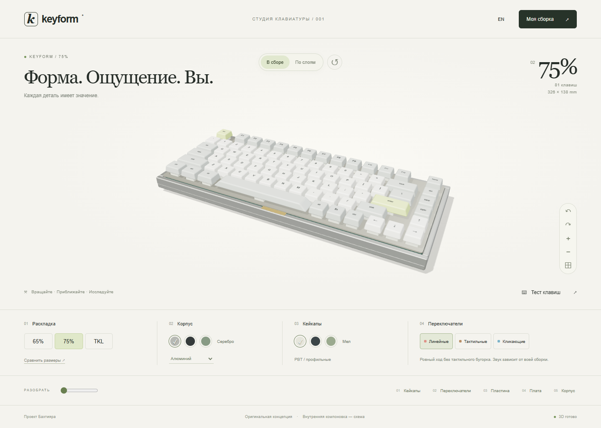

# Keyform

An original mechanical keyboard studio for Bakhtiyar's portfolio. A working configurator built with React, TypeScript and Three.js, with procedural geometry and no external model or texture downloads.

## Try it

[Open the studio](https://moyisey.github.io/keyform/)



[Exploded view](docs/keyform-exploded.png) · [Mobile view](docs/keyform-mobile.png)

Choose a 65%, 75% or TKL layout, customise the case and keycaps, explore five mechanical layers, compare footprints and test the keys. Use **Your build** for JSON import/export, a text build sheet, a configuration link and explicit device-local save/restore.

The keyboard is a concept, not a purchasable product. Dimensions are design targets. PCB traces, switch housings and internal assembly are schematic. No real component compatibility, price, sound simulation or manufacturing suitability is claimed.

## Local development

Node.js 22.12+ or 24, npm:

```sh
npm ci
npm run dev
```

The server binds to `127.0.0.1:5193` with a strict port. It never kills or reuses another project's process.

```sh
npm test
npm run build
npm run preview
```

For browser checks, keep the server running and use `npm run test:e2e`. Tests use installed Microsoft Edge on Windows; other platforms use Playwright Chromium (`npx playwright install chromium`). Override the target with `KEYFORM_URL`, including the trailing slash. The CI workflow verifies the production build before publishing it to GitHub Pages.

## Structure

- `src/model.ts`: strict versioned configuration validation, URL encoding, build sheet, exact physical key coordinates and bilingual component descriptions.
- `src/KeyboardScene.tsx`: original procedural meshes, generated legend atlas and environment, raycasting, orbit/touch controls, separated layers, demand rendering and disposal.
- `src/App.tsx`: accessible RU/EN controls, modal focus management, configuration import/export, optional storage and scoped key test.
- `src/style.css`: responsive cream studio layout and reduced-motion handling.
- `tests/`: state invariants, untrusted input, browser workflows and screenshots.

## Privacy and interaction

No analytics, cookies, backend or remote assets. Physical `keydown`/`keyup` handlers exist only on the explicitly enabled textarea. Leaving it disables the test; Escape exits the field and Tab keeps normal navigation. Test text is cleared when the test closes, never saved, included in URLs or exported. The screen keyboard tests the concept's physical key positions; OS shortcuts and hardware Fn are not universally observable.

Configuration links contain only the seven validated configuration properties. Local storage is written only after **Save on this device**. Invalid, oversized or unknown-version files leave the current build unchanged. A WebGL failure retains a schematic 2D view and configuration/test/export tools. This is not an offline-installable PWA; initial loading requires a running local server or access to the hosted site.

## Original work and dependencies

All keyboard meshes, key legends, material colours, UI and marks are authored in this project. No reference footage, third-party device models, fonts or product photography are distributed. React, Three.js and development tools retain their respective upstream licences; see `THIRD_PARTY.md` and the package lock.
